# Capítulo V: Product Implementation, Validation & Deployment
## 5.1. Software Configuration Management
### 5.1.1. Software Development Environment Configuration

**Requirements Management**

1. Trello: Es una herramienta utilizada para gestionar el flujo de trabajo de proyectos principalmente basados en marcos detrabajos ágiles. Será empleado para visualizar y actualizar el estado actual de las tareas e historias de usuariopertenecientes al sprint a desarrollar. Ruta de referencia https://trello.com/es
2. Vertabelo: Herramienta técnica para diseñar y modelar bases de datos. Ruta de referencia https://vertabelo.com

**Product UX/UI Design**

1. Figma: Plataforma de elaboración de prototipos y edición gráfica, principalmente utilizado para el diseño digital. En elcaso del proyecto, será utilizado para el prototipado de la aplicación y sus versiones de Desktop y Mobile Web Browser.Ruta de referencia https://www.figma.com/login2.
2. LucidChart: Aplicación para diagramar flujos. Será empleado para el diseño de wireflows, user-flows y el diagrama declases asociado a la aplicación. Ruta de referencia https://www.lucidchart.com/

**Software Development**

1. WebStorm: Entorno de desarrollo integrado elegido para la elaboración y compilación del código por motivos dedominio por parte de los integrantes del equipo de trabajo. Utilizar este IDE supone de valor para el desarrollo del proyecto puesto que incluye la posibilidad de agregar extensiones de utilidad, soporte de edición de texto en múltipleslenguajes de programación, disponibilidade en múltiples sistemas operativos, entre otros beneficios. Ruta de referencia https://www.jetbrains.com/webstorm/
2. HTML5: HyperText Markup Language, o por sus siglas HTML, es un lenguaje de etiquetado para páginas web. Seráempleado en el desarrollo del proyecto para la presentación del contenido en la aplicación. Ruta de referenciahttps://www.w3schools.com/html/html5_syntax.asp
3. CSS: Cascading Style Sheets es un lenguaje que maneja el diseño y presentación de las página
para elaborar la interfaz deusuario dentro de la aplicación. Ruta de referencia https://developer.mozilla.org/es/docs/Web/JavaScript
5. Angular: Angular es un framework de desarrollo de aplicaciones web de código abierto y basado en TypeScript, mantenido por Google y una comunidad de desarrolladores. Es utilizado para crear aplicaciones web de una sola página (SPA) y aplicaciones web dinámicas. Angular proporciona un conjunto de herramientas y bibliotecas que simplifican el desarrollo de aplicaciones web complejas al seguir el patrón de arquitectura Modelo-Vista-Controlador (MVC) y ofrecer funcionalidades como enlace de datos bidireccional, inyección de dependencias, rutas, formularios reactivos, animaciones y mucho más https://angular.io/

**Software Deployment**

1. Git: Herramienta de control de versiones que permite registrar y gestionar las diferentes versiones del programa. Seutilizará para mantener un historial de cambios y simplificar la corrección de errores. Los miembros del equipo accederána través de la línea de comandos en sus sistemas locales. Ruta de referencia https://git-scm.com/

**Software Documentation and Project Management**

1. Github: Plataforma basada en la nube que alojará los repositorios de código del proyecto. Facilitará la colaboración entiempo real y la revisión de contribuciones de cada miembro del equipo. Los miembros del equipo accederán a través desus navegadores web. Ruta de referencia https://github.com/

### 5.1.2. Source Code Management

Para organizar nuestro proyecto y sus modificaciones, hemos seguido lo propuesto por Vincent Dreissen: un modelo de Git de branching permite gestionar ramas de un proyecto, asi como facilitar el flujo de trabajo. Partimos con una main branch o rama master, y junto a ella, una develop branch. A partir de la rama master, surgen las Hotfix branches, que nos permiten solucionar problemas criticos directamente de la rama master. También creamos Feature branches para los cambios que hicimos a lo largo del proyecto. Estos, mediante un merge, se unen a la develop Branch. Y la develop branch al Main.

**Liks del repositorio de GitHub**:

- Link de la organización: https://github.com/1ASI0729-2510-4313-G5-Bikeshare
- Link de la landing page: https://github.com/1ASI0729-2510-4313-G5-Bikeshare/LandingPage
- Link del informe: https://github.com/1ASI0729-2510-4313-G5-Bikeshare/Report.git
- Link del front end: https://github.com/1ASI0729-2510-4313-G5-Bikeshare/Frontend.git
- Link del back end: https://github.com/1ASI0729-2510-4313-G5-Bikeshare/Backend.git
  
Estrucutra de las ramas:

- **Main Branch:** Esta rama es la principal de la aplicación. Donde se encontrarán las versiones más estables del desarrollo. Solo se admiten cambios que hayan sido probados en otras ramas.
- **Develop Branch:** Esta rama es donde se realizarán los avances del proyecto y desarollo.
- **Feature Branch:** Esta rama es donde se implementarán nuevas características de la aplicación, para luego ser enviada a la rama de desarrollo.
- **Release Branch:** Esta rama es una instancia de la rama Develop, para posteriormente ser enviada a la rama Main.
- **Hotfix Branch:** Estas ramas son creadas con la finalidad de corregir errores puntuales que puedan estar perjudicando al usuario en su experiencia de uso de la aplicación.

### 5.1.3. Source Code Style Guide & Conventions

**HTML**: Unas de las prácticas que hemos seguido para alcanzar un código limpio, conciso, coherente, legible y escalable son las siguientes:

- Se usan elementos HTML que tengan un significado claro y preciso para el contenido que se está marcando. Por ejemplo, utiliza header, nav, main, article, section, aside, footer, entre otros, para estructurar la landing page de forma semántica.
- Aunque HTML5 permite algunas etiquetas sin cierre (como "img" y "input"), utilizamos la buena práctica de cerrar todas las etiquetas correctamente para evitar problemas de renderizado. Por ejemplo: `
 Código claro y legible.
`
- Para mejorar la accesibilidad, siempre incluye el atributo alt en las etiquetas "img" para describir brevemente el contenido de la imagen. Por ejemplo: ``
- HTML permite combinar mayúsculas y minúsculas en los nombres de los elementos y atributos, pero limitamos dar
  al uso de solo minúsculas para preservar el orden y asegurar la legibilidad del código.
- No omitir las etiquetas `<html>`, `<body>` y `<header>`.
- Escribir en una línea los comentarios cortos.

**CSS**: Entre las prácticas se mencionan:

- Los nombres de clases son intuitivos, legibles y autodescriptivos.
- Separar los nombres de las clases y ID con guión, por ejemplo: `#userViajero-id` y`.userImg-shape{}`
- Separar las declaraciones y selectores en nuevas líneas para agilizar la legibilidad.
- Usar comentarios para explicar el código.
- Aplicar sangría a todo el contenido de un bloque.

**JavaScript**: Principales prácticas aplicadas:

- Uso de camelCase para nombrar variables y funciones. Por ejemplo, `myVariable` y `myFunction`.
- Uso de PascalCase para nombrar clases y constructores.Por ejemplo, `myClass`.
- Evitar el uso de nombres de variables genéricos o ambiguos.
- Uso general de comentarios para explicar el propósito y funcionalidad de la porción del código.
- Uso de punto y coma al final de cada declaración.
- Uso de comillas simples ('') o comillas dobles ("") de forma consistente para las cadenas de texto.
- Organización del código en bloques lógicos separados por líneas en blanco para mejorar la legibilidad.
- Uso de el operador ternario `(condición ? resultadoTrue : resultadoFalse)` de manera adecuada y legible.
- Evitar el uso de funciones obsoletas o en desuso.
- Uso de try-catch para manejar y gestionar errores de manera adecuada.

### 5.1.4. Software Deployment Configuration

Para desplegar la landing page es necesario contar con una serie de requisitos, entre ellos, es necesario contar con una cuenta personal, una organización y un repositorio al cual cargar los documentos. A partir de lo anterior, es posible comenzar el despliegue de la landing page. A continuación se enuncian los pasos a seguir:
Crear una carpeta llamada "docs" para alojar el Landing Page. Asegurarse de que los archivos sigan las nomenclaturas "index.html", "style.css", "funcionalities.js" y una carpeta llamada "img" que contenga las imágenes. Cargar los archivos al repositorio mediante un commit. Dirigirse a Settings > Pages y seleccionar el branch correspondiente, en nuestro caso es el "main". Especificar la carpeta "docs" como la fuente de la página. Esperar a que GitHub realice las comprobaciones necesarias. Una vez culminado el proceso, se obtendrá un enlace que llevará al Landing Page desplegado

## 5.2. Landing Page, Services & Applications Implementation
### 5.2.1. Sprint 1
#### 5.2.1.1. Sprint Planning 1
<table style="border-collapse: collapse; width: 100%;">
<tbody>
<tr><td style="border:1pt solid #000000;padding:5pt;vertical-align:top;"><strong>Sprint #</strong></td><td style="border:1pt solid #000000;padding:5pt;vertical-align:top;"><strong>Sprint 1</strong></td></tr>
<tr><td style="border:1pt solid #000000;padding:5pt;vertical-align:top;" colspan="2"><strong>Sprint Planning Backlog</strong></td></tr>
<tr><td style="border:1pt solid #000000;padding:5pt;vertical-align:top;">Date</td><td style="border:1pt solid #000000;padding:5pt;vertical-align:top;">2025-04-06</td></tr>
<tr><td style="border:1pt solid #000000;padding:5pt;vertical-align:top;">Time</td><td style="border:1pt solid #000000;padding:5pt;vertical-align:top;">21:00</td></tr>
<tr><td style="border:1pt solid #000000;padding:5pt;vertical-align:top;">Location</td><td style="border:1pt solid #000000;padding:5pt;vertical-align:top;">Google Meet</td></tr>
<tr><td style="border:1pt solid #000000;padding:5pt;vertical-align:top;">Prepared By</td><td style="border:1pt solid #000000;padding:5pt;vertical-align:top;">Karen Ramos</td></tr>
<tr><td style="border:1pt solid #000000;padding:5pt;vertical-align:top;">Attendees</td><td style="border:1pt solid #000000;padding:5pt;vertical-align:top;">Todos los miembros de RepoRangers</td></tr>
<tr><td style="border:1pt solid #000000;padding:5pt;vertical-align:top;" colspan="2"><strong>Sprint Goal &amp; User Stories</strong></td></tr>
<tr><td style="border:1pt solid #000000;padding:5pt;vertical-align:top;">Sprint 1 Goal</td><td style="border:1pt solid #000000;padding:5pt;vertical-align:top;"> El objetivo del Sprint 1 es crear la organización RepoRangers en GitHub y establecer el repositorio principal para el proyecto, asegurando una gestión adecuada del código y facilitando la colaboración del equipo desde el inicio. Además, se implementará la landing page, con un diseño responsivo y funcional que permitirá presentar el proyecto y ofrecer una navegación clara para los usuarios. Al finalizar este sprint, se contará con la organización y repositorio configurados, la landing page desplegada en un entorno de prueba, y la documentación inicial que guiará el acceso y uso del repositorio, sentando así las bases para el desarrollo y la experiencia de usuario del proyecto.</td></tr>
<tr><td style="border:1pt solid #000000;padding:5pt;vertical-align:top;">Sprint 1 Velocity</td><td style="border:1pt solid #000000;padding:5pt;vertical-align:top;"><strong>14</strong></td></tr>
<tr><td style="border:1pt solid #000000;padding:5pt;vertical-align:top;">Sum of Story Points</td><td style="border:1pt solid #000000;padding:5pt;vertical-align:top;"><strong>14</strong></td></tr>
</tbody>
</table>

#### 5.2.1.2. Sprint Backlog 1

En el primer Sprint, se implementará la página LandingPage de TakeMyCar. La herramienta para gestionar a los miebros del equipo y visualizar los avanzes del proyecto será Trello.

Aqui podra encontrar la evidencia de Trelo:
https://trello.com/b/caq6CxCA/bikeshare-sprint-1

### Sprint 1

<table border="1" cellspacing="0" cellpadding="5">
  <tr>
    <td colspan="2" align="center"><b>Sprint #</b></td>
    <td colspan="6" align="center"><b>Sprint 1</b></td>
  </tr>
  <tr>
    <td colspan="2"><b>User Story</b></td>
    <td colspan="6" align="center"><b>Work-Item/Task</b></td>
  </tr>
  <tr>
    <td><b>Id</b></td>
    <td><b>Title</b></td>
    <td><b>Task Id</b></td>
    <td><b>Task Title</b></td>
    <td><b>Description</b></td>
    <td><b>Estimation (Hours)</b></td>
    <td><b>Assigned To</b></td>
    <td><b>Status (To-do/In-Process/To-Review/Done)</b></td>
  </tr>
  <tr>
    <td rowspan="2">US01</td>
    <td rowspan="2">Sección Home</td>
    <td>T1</td>
    <td>Barra de Navegación</td>
    <td>Interacción con la Barra de navegación	</td>
    <td>1</td>
    <td>Rodrigo Alaya Cabrera	</td>
    <td>Done</td>
  </tr>
  <tr>
    <td>T2</td>
    <td>Diseño del Hero</td>
    <td>Desarrollo del diseño de la sección principal</td>
    <td>2</td>
    <td>Niurka Lucero Huarcaya Quispe	</td>
    <td>Done</td>
  </tr>
  <tr>
    <td>US02</td>
    <td>Sección "Our System"</td>
    <td>T1</td>
    <td>Diseño de our system</td>
    <td>Desarrollo del diseño de la sección our system</td>
    <td>2</td>
    <td>Maria Fernanda Mostajo Orosco</td>
    <td>Done</td>
  </tr>
  <tr>
    <td>US03</td>
    <td>Sección "Be a partner"	</td>
    <td>T1</td>
    <td>Diseño de be a partner</td>
    <td>Desarrollo del diseño de la sección be a partner	</td>
    <td>2</td>
    <td>Karen Stephanie Ramos Carpio</td>
    <td>Done</td>
  </tr>
  <tr>
    <td>US04</td>
    <td>Sección "Reviews"	</td>
    <td>T1</td>
    <td>Barra de reviews	</td>
    <td>Interacción con reviews	</td>
    <td>1</td>
    <td>José Luis Martinez Valdivia	</td>
    <td>Done</td>
  </tr>
  <tr>
    <td>US05</td>
    <td>Cambio de idioma	</td>
    <td>T1</td>
    <td>Diseño del idioma	</td>
    <td>Desarrollo del diseño del cambio de idioma</td>
    <td>2</td>
    <td>José Luis Martinez Valdivia	</td>
    <td>Done</td>
  </tr>
  <tr>
</table>

#### 5.2.1.3. Development Evidence for Sprint Review

A continuación se presentan informacion de los commits de la Landing page de BikeShare, con el uso de HTML, CSS y JavaScript

|Repository Branch |  Commit Id  |  Commit Message | Commit Message Body | Commited on (Date)|
|-----------------|--------------|-----------------|---------------------|-------------------|
|Landing Page - develop   |   4c76760…f3dcfd9     |  chores(landingpage): added some translation words    |           |   26/04/2025 |
|Landing Page - develop   |    c62b615…4c76760     |  chore(landingpage): add completed landing page       |           |   26/04/2025 |
|Landing Page - ourSystem   |   c62b615…3c7fbde      |  feature(OurSystem): completed landing page-OurSystem - added HTML  |    |25/04/2025|
|Landing Page - home   |   c62b615…7769d76     |  feat: add section home structure and styling    |           |   24/04/2025 |
|Landing Page - BeAPartner   |   c62b615…3f0f246     |  update landing page beapartner   |           |   24/04/2025 |
| Landing Page - Reviews |  c62b615…6a35cc4         |  feature(reviews): completed Reviews on an 80%  |    |      18/04/2025     |

            
#### 5.2.1.4. Testing Suite Evidence for Sprint Review

En el transcurso del primer sprint, no se realizaron pruebas en la aplicación ya que nuestro enfoque estuvo dirigido exclusivamente a la construcción de la página de inicio.

#### 5.2.1.5. Execution Evidence for Sprint Review

A continuación se presentan capturas del landing page implementado parcialmente en código, con el uso de HTML, CSS y JavaScript.
Link: (https://shorturl.at/ezDLe)

- Home: 

   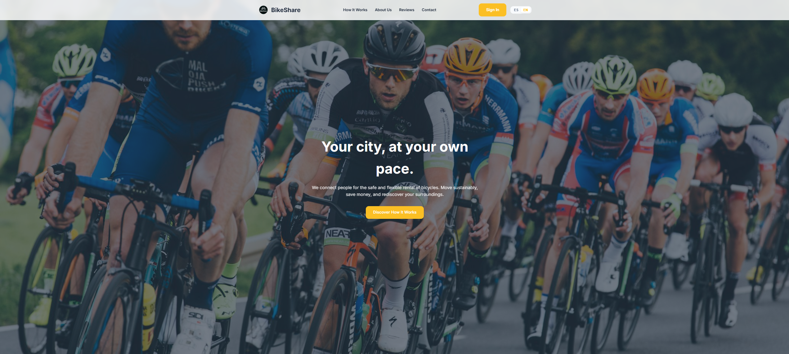
<br?
- OurSystem: 

   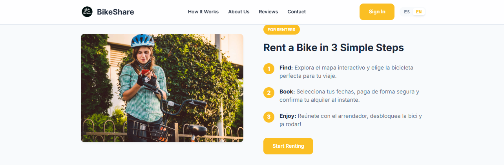

  >br?
- BeAPartner:  

  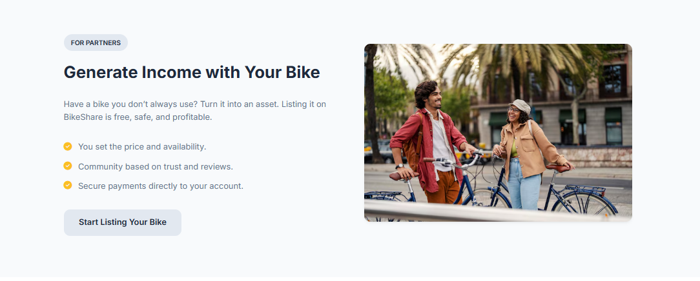
  
   
- Reviews:  

  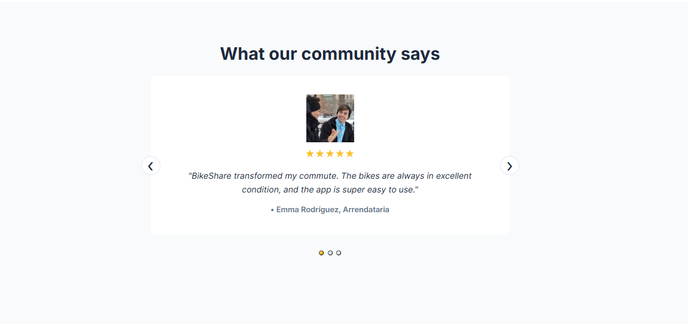

   

#### 5.2.1.6. Services Documentation Evidence for Sprint Review

En este sprint en particular, no hemos utilizado servicios web, ya que nos hemos concentrado exclusivamente en la creación de la página de inicio estática. Por lo tanto, en esta presentación no se proporciona documentación relacionada con la utilización de servicios web.

#### 5.2.1.7. Software Deployment Evidence for Sprint Review

Hasta ahora, no hemos utilizado servicios web en el proceso de desarrollo de la página de inicio. Esto significa que no hemos realizado actividades como la creación de cuentas, la configuración de recursos en proveedores de servicios en la nube, la creación de proyectos de desarrollo para la integración o automatización de tareas de implementación, entre otras acciones relacionadas.

En cuanto al despliegue de la página de inicio, lo hemos realizado en la plataforma de Github Pages.

Se puede acceder a la página de inicio a través del siguiente enlace: https://1asi0729-2510-4313-g5-bikeshare.github.io/LandingPage/

#### 5.2.1.8. Team Collaboration Insights during Sprint

A continuación, se muestran las capturas de los insights del repositorio de la Landing Page para evidenciar la participación de todos los miembros del grupo:

### 5.2.2. Sprint 2
#### 5.2.2.1. Sprint Planning 2

<table style="border-collapse: collapse; width: 100%;">
<tbody>
<tr><td style="border:1pt solid #000000;padding:5pt;vertical-align:top;"><strong>Sprint #</strong></td><td style="border:1pt solid #000000;padding:5pt;vertical-align:top;"><strong>Sprint 2</strong></td></tr>
<tr><td style="border:1pt solid #000000;padding:5pt;vertical-align:top;" colspan="2"><strong>Sprint Planning Backlog</strong></td></tr>
<tr><td style="border:1pt solid #000000;padding:5pt;vertical-align:top;">Date</td><td style="border:1pt solid #000000;padding:5pt;vertical-align:top;">2025-04-31</td></tr>
<tr><td style="border:1pt solid #000000;padding:5pt;vertical-align:top;">Time</td><td style="border:1pt solid #000000;padding:5pt;vertical-align:top;">21:00</td></tr>
<tr><td style="border:1pt solid #000000;padding:5pt;vertical-align:top;">Location</td><td style="border:1pt solid #000000;padding:5pt;vertical-align:top;">Google Meet</td></tr>
<tr><td style="border:1pt solid #000000;padding:5pt;vertical-align:top;">Prepared By</td><td style="border:1pt solid #000000;padding:5pt;vertical-align:top;">Jose Martinez</td></tr>
<tr><td style="border:1pt solid #000000;padding:5pt;vertical-align:top;">Attendees</td><td style="border:1pt solid #000000;padding:5pt;vertical-align:top;">Todos los miembros de BikeShare</td></tr>
<tr><td style="border:1pt solid #000000;padding:5pt;vertical-align:top;" colspan="2"><strong>Sprint Goal; User Stories</strong></td></tr>
<tr><td style="border:1pt solid #000000;padding:5pt;vertical-align:top;">Sprint 2 Goal</td><td style="border:1pt solid #000000;padding:5pt;vertical-align:top;"> Nuestro enfoque en este sprint se centra en la delegación de tareas para el desarrollo del front-end del aplicativo, con el objetivo de mejorar la eficiencia y optimizar la implementación dentro del equipo de desarrollo. Creemos que esta estrategia permitirá una distribución más clara de responsabilidades, facilitando la integración de los componentes y asegurando que cada parte cumpla con los requisitos de diseño y funcionalidad establecidos. La confirmación de este impacto se dará cuando los elementos del front-end se implementen correctamente y su rendimiento cumpla con las expectativas del producto.</td></tr>
<tr><td style="border:1pt solid #000000;padding:5pt;vertical-align:top;">Sprint 2 Velocity</td><td style="border:1pt solid #000000;padding:5pt;vertical-align:top;"><strong>32</strong></td></tr>
<tr><td style="border:1pt solid #000000;padding:5pt;vertical-align:top;">Sum of Story Points</td><td style="border:1pt solid #000000;padding:5pt;vertical-align:top;"><strong>51</strong></td></tr>
</tbody>
</table>

#### 5.2.2.2. Aspect Leaders and Collaborators

 |Team Member | GitHub Username |  Delegating Responsibilities   Leader (L) / Collaborator (C) | Merging Branches  Leader (L) /Collaborator (C)| Correcting Mistakes   Leader (L) /Collaborator (C)|
|-------------|--------------|------------|----------|----------|
| Jose Luis Martinez Validiva | hmongus  |    L   |    C     | L  |
| Niurka Lucero Huarcaya Quispe		 | NLH18  |    C   |     C    | C  |
| Rodrigo Alaya Cabrera		 | ALAYA1803  |  C     |   L      |  C  |
| Maria Fernanda Mostajo Orosco	 | Mafer-m30  |    C   |    C     |   C   |
| Karen Stephanie Ramos Carpio | KarenRamos2  |   C    |    C     |   C   |

#### 5.2.2.3. Sprint Backlog 2

<table border="1">
  <thead>
    <tr>
      <th>Sprint #</th>
      <th colspan="7">Sprint 2</th>
    </tr>
    <tr>
      <th colspan="2">User Story</th>
      <th colspan="6">Work-Item / Task</th>
    </tr>
    <tr>
      <th>Id</th>
      <th>Title</th>
      <th>Id</th>
      <th>Title</th>
      <th>Description</th>
      <th>Estimation (Hours)</th>
      <th>Assigned To</th>
      <th>Status (To-do / In-Process / To-Review / Done)</th>
    </tr>
  </thead>
  <tbody>
    <tr>
      <td>US07</td>
      <td>Registro de usuario</td>
      <td>T01</td>
      <td>Selección de rol</td>
      <td>Diseñar y desarrollar la pantalla de selección de rol en el registro, permitiendo la elección entre arrendador y arrendatario con navegación adecuada</td>
      <td>4</td>
      <td>Maria Fernanda Mostajo Orosco</td>
      <td>In-Process</td>
    </tr>
    <tr>
      <td>US07</td>
      <td>Registro de usuario</td>
      <td>T02</td>
      <td>Registro de cuenta</td>
      <td>Implementar la interfaz de registro de cuenta, permitiendo al usuario ingresar su correo y contraseña, con validaciones básicas en el frontend</td>
      <td>5</td>
      <td>Rodrigo Alaya Cabrera</td>
      <td>Done</td>
    </tr>
    <tr>
      <td>US20</td>
      <td>Búsqueda de estaciones de bicicletas cercanas con Google Maps</td>
      <td>T03</td>
      <td>Implementación de búsqueda de estaciones de bicicletas</td>
      <td>Desarrollar la funcionalidad en el frontend para permitir a los usuarios buscar las estaciones disponibles con Google Maps</td>
      <td>8</td>
      <td>Rodrigo Alaya Cabrera</td>
      <td>Done</td>
    </tr>
    <tr>
      <td>US09</td>
      <td>Inicio de sesión</td>
      <td>T04</td>
      <td>Implementación de inicio de sesión</td>
      <td>Desarrollar la interfaz para el inicio de sesión, permitiendo a los usuarios acceder con su correo y contraseña</td>
      <td>6</td>
      <td>José Luis Martinez Valdivia</td>
      <td>Done</td>
    </tr>
    <tr>
      <td>US10</td>
      <td>Edición de datos personales</td>
      <td>T05</td>
      <td>Implementación de edición de datos personales</td>
      <td>Desarrollar la interfaz que permita a los usuarios actualizar su información personal con validaciones en el frontend</td>
      <td>5</td>
      <td>Niurka Lucero Huarcaya Quispe</td>
      <td>In-Process</td>
    </tr>
    <tr>
      <td>US11</td>
      <td>Cierre de sesión</td>
      <td>T06</td>
      <td>Implementación de cierre de sesión</td>
      <td>Desarrollar la funcionalidad en el frontend que permita a los usuarios cerrar sesión de manera segura</td>
      <td>4</td>
      <td>Maria Fernanda Mostajo Orosco</td>
      <td>In-Process</td>
    </tr>
    <tr>
      <td>US12</td>
      <td>Registro de una bicicleta</td>
      <td>T07</td>
      <td>Implementación de registro de bicicleta</td>
      <td>Desarrollar la interfaz que permita a los usuarios registrar su bicicleta, ingresando los datos relevantes </td>
      <td>6</td>
      <td>Karen Stephanie Ramos Carpio</td>
      <td>In-Process</td>
    </tr>
     <tr>
      <td>US13</td>
      <td>Edición de información de una bicicleta</td>
      <td>T08</td>
      <td>Implementación de edición de información de bicicleta</td>
      <td>Desarrollar la interfaz que permita a los usuarios actualizar los detalles de su bicicleta</td>
      <td>4</td>
      <td>Rodrigo Alaya Cabrera</td>
      <td>In-Process</td>
    </tr>
     <tr>
      <td>US14</td>
      <td>Eliminación de una bicicleta</td>
      <td>T09</td>
      <td>Implementación de eliminación de bicicleta</td>
      <td>Desarrollar la interfaz que permita a los usuarios eliminar el registro de una bicicleta, asegurando confirmación previa</td>
      <td>6</td>
      <td>Niurka Lucero Huarcaya Quispe</td>
      <td>In-Process</td>
    </tr>
    <tr>
      <td>US15</td>
      <td>Historial de alquileres</td>
      <td>T10</td>
      <td>Implementación del historial de alquileres</td>
      <td>Desarrollar la interfaz que muestre el historial de alquileres del usuario, permitiendo visualizar los datos</td>
      <td>6</td>
      <td>José Luis Martinez Valdivia</td>
      <td>In-Process</td>
    </tr>
    <tr>
      <td>US16</td>
      <td>Visualización de estadísticas de uso</td>
      <td>T11</td>
      <td>Implementación de visualización de estadísticas de uso</td>
      <td>Desarrollar la interfaz que permita a los usuarios visualizar estadísticas de uso</td>
      <td>6</td>
      <td>Maria Fernanda Mostajo Orosco</td>
      <td>In-Process</td>
    </tr>
    <tr>
      <td>US17</td>
      <td>Calificaciones y comentarios de arrendatarios</td>
      <td>T12</td>
      <td>Implementación de calificaciones y comentarios de arrendatarios</td>
      <td>Desarrollar la interfaz que permita a los usuarios calificar y dejar comentarios sobre sus arrendadores</td>
      <td>7</td>
      <td>Karen Stephanie Ramos Carpio</td>
      <td>In-Process</td>
    </tr>
    <tr>
      <td>US18</td>
      <td>Configuración de disponibilidad</td>
      <td>T13</td>
      <td>Implementación de configuración de disponibilidad</td>
      <td>Desarrollar la interfaz que permita a los arrendadores establecer los días y horarios en los que su bicicleta estará disponible para alquiler</td>
      <td>7</td>
      <td>Rodrigo Alaya Cabrera</td>
      <td>In-Process</td>
    </tr>
  </tbody>
</table>

En este sprint, se abordarán tareas clave como la implementación de validaciones, ajustes en la experiencia visual y la configuración de componentes interactivos que faciliten la navegación. A continuación, se presenta el tablero de Trello con la organización de tareas y su estado actual dentro del sprint.

Link del Trello: https://trello.com/b/caq6CxCA/bikeshare-sprint-1

#### 5.2.2.4. Development Evidence for Sprint Review

Se presentan los commits realizados en el repositorio de GitHub, en el cual se puede observar el trabajo realizado por cada integrante del equipo.

- Repositorio Frontend: https://github.com/1ASI0729-2510-4313-G5-Bikeshare/Frontend

 

<table  align="left" border="1" width="100%">
    <tr>
        <th>Repository</th>
        <th>Branch</th>
        <th>Commit ID</th>
        <th>Commit Message</th>
        <th>Commit Message Body</th>
        <th>Commited on (Date)</th>
    </tr>
    <tr>
        <td rowspan=6>Frontend</td>
        <td>feature/login-home</td>
        <td>1031069</td>
        <td>feat: add login-home</td>
        <td>-</td>
        <td>16/05/25</td>
    </tr>
    <tr>
        <td>feature/create-account-home</td>
        <td>70b54f0</td>
        <td>feat: add create account home</td>
        <td>-</td>
        <td>16/05/25</td>
    <tr>
    <tr>
        <td>feature/profile</td>
        <td>b4c8f05</td>
        <td>feat: add profile section</td>
        <td>-</td>
        <td>15/05/25</td>
    <tr>
    <tr>
        <td>feature/frontend</td>
        <td>d77091c</td>
        <td>feature:Initial commit BikeShare-frontend</td>
        <td>-</td>
        <td>16/05/25</td>
    <tr>
</table>

 

#### 5.2.2.5. Execution Evidence for Sprint Review

Durante este sprint se completaron importantes avances en la ejecución del Front-End de BikeShare utilizando Angular CLI. Se implementaron vistas clave como el registro e inicio de sesión tanto para clientes como arrendadores, la creación la vista principal del cliente, su panel de servicios y el perfil del usuario cliente.

Estas funcionalidades consolidan la base operativa de la plataforma, permitiendo una experiencia inicial completa para ambas partes del sistema: usuarios que buscan servicios de reparación y técnicos que los ofrecen.

Link del proyecto: https://lucky-treacle-8d6a1c.netlify.app/

#### 5.2.2.6. Services Documentation Evidence for Sprint Review

Para este sprint no se implemento API alguna ya que no realizo el desarrollo de un backend. Sin embargo, se realizo una FakeApi.

#### 5.2.2.7. Software Deployment Evidence for Sprint Review

A continuación, se muestran las capturas del despliegue del Frontend de la aplicación Bikeshare:

- MockAPI:    

 

- Netlify:   
 

 

- Video Implementacion: (https://shorturl.at/Qrk5p)    

 

#### 5.2.2.8. Team Collaboration Insights during Sprint

Durante este sprint, la colaboración del equipo se mantuvo constante y bien organizada, facilitando el cumplimiento exitoso de los objetivos establecidos.En la reunión, se asignaron responsabilidades específicas a cada integrante, permitiendo una distribución eficiente del trabajo y un entendimiento claro de las tareas a ejecutar. A lo largo de este sprint se lograron avances significativos en el desarrollo del Front-End de RepairLink, empleando Angular CLI. Se llevaron a cabo implementaciones clave, entre las que destacan las interfaces para el registro e inicio de sesión de clientes y arrendadores, la configuración del perfil profesional usuario, así como la vista principal del cliente, su panel de servicios y su perfil personal. El equipo mantuvo una comunicación activa y efectiva durante todo el sprint, utilizando WhatsApp como canal principal para resolver dudas rápidas y coordinar avances. Esta estrategia permitió que los integrantes estuvieran alineados en todo momento, promoviendo un flujo de trabajo continuo y sin interrupciones significativas, nos basamos en diseñar e implementar el FrontEnd con el objetivo de concretar nuestra propuesta de valor.  

### 5.2.3. Sprint 3
#### 5.2.3.1. Sprint Planning 3
<table style="border-collapse: collapse; width: 100%;">
<tbody>
<tr><td style="border:1pt solid #000000;padding:5pt;vertical-align:top;"><strong>Sprint #</strong></td><td style="border:1pt solid #000000;padding:5pt;vertical-align:top;"><strong>Sprint 3</strong></td></tr>
<tr><td style="border:1pt solid #000000;padding:5pt;vertical-align:top;" colspan="2"><strong>Sprint Planning Backlog</strong></td></tr>
<tr><td style="border:1pt solid #000000;padding:5pt;vertical-align:top;">Date</td><td style="border:1pt solid #000000;padding:5pt;vertical-align:top;">2025-05-28</td></tr>
<tr><td style="border:1pt solid #000000;padding:5pt;vertical-align:top;">Time</td><td style="border:1pt solid #000000;padding:5pt;vertical-align:top;">21:00</td></tr>
<tr><td style="border:1pt solid #000000;padding:5pt;vertical-align:top;">Location</td><td style="border:1pt solid #000000;padding:5pt;vertical-align:top;">Google Meet</td></tr>
<tr><td style="border:1pt solid #000000;padding:5pt;vertical-align:top;">Prepared By</td><td style="border:1pt solid #000000;padding:5pt;vertical-align:top;">Jose Martinez</td></tr>
<tr><td style="border:1pt solid #000000;padding:5pt;vertical-align:top;">Attendees</td><td style="border:1pt solid #000000;padding:5pt;vertical-align:top;">Todos los miembros de BikeShare</td></tr>
<tr><td style="border:1pt solid #000000;padding:5pt;vertical-align:top;" colspan="2"><strong>Sprint Goal; User Stories</strong></td></tr>
<tr><td style="border:1pt solid #000000;padding:5pt;vertical-align:top;">Sprint 3 Goal</td><td style="border:1pt solid #000000;padding:5pt;vertical-align:top;"> Nuestro enfoque en este sprint se centra en la delegación de tareas para el desarrollo del backend del aplicativo, con el objetivo de mejorar la eficiencia y optimizar la implementación dentro del equipo de desarrollo. Creemos que esta estrategia permitirá una distribución más clara de responsabilidades, facilitando la integración de los componentes y asegurando que cada parte cumpla con los requisitos de diseño y funcionalidad establecidos. La confirmación de este impacto se dará cuando la estructura y los elementos del backend se implementen correctamente y su rendimiento cumpla con las expectativas del producto.</td></tr>
<tr><td style="border:1pt solid #000000;padding:5pt;vertical-align:top;">Sprint 3 Velocity</td><td style="border:1pt solid #000000;padding:5pt;vertical-align:top;"><strong> 19 </strong></td></tr>
<tr><td style="border:1pt solid #000000;padding:5pt;vertical-align:top;">Sum of Story Points</td><td style="border:1pt solid #000000;padding:5pt;vertical-align:top;"><strong> 51 </strong></td></tr>
</tbody>
</table>

#### 5.2.3.2. Aspect Leaders and Collaborators.

 |Team Member | GitHub Username |  Delegating Responsibilities   Leader (L) / Collaborator (C) | Merging Branches  Leader (L) /Collaborator (C)| Correcting Mistakes   Leader (L) /Collaborator (C)|
|-------------|--------------|------------|----------|----------|
| Jose Luis Martinez Validiva | hmongus  |    L   |    C     | L  |
| Niurka Lucero Huarcaya Quispe		 | NLH18  |    C   |     C    | C  |
| Rodrigo Alaya Cabrera		 | ALAYA1803  |  C     |   L      |  C  |
| Maria Fernanda Mostajo Orosco	 | Mafer-m30  |    C   |    C     |   C   |
| Karen Stephanie Ramos Carpio | KarenRamos2  |   C    |    C     |   C   |

#### 5.2.3.3.Sprint Backlog 3.

<table border="1">
  <thead>
    <tr>
      <th>Sprint #</th>
      <th colspan="7">Sprint 3</th>
    </tr>
    <tr>
      <th colspan="2">User Story</th>
      <th colspan="6">Work-Item / Task</th>
    </tr>
    <tr>
      <th>Id</th>
      <th>Title</th>
      <th>Id</th>
      <th>Title</th>
      <th>Description</th>
      <th>Estimation (Hours)</th>
      <th>Assigned To</th>
      <th>Status (To-do / In-Process / To-Review / Done)</th>
    </tr>
  </thead>
  <tbody>
    <tr>
      <td rowspan="3">US22</td>
      <td rowspan="3">Alquiler de bicicleta</td>
      <td>T01</td>
      <td>Diseño e implementación del modelo de renta en la base de datos</td>
      <td>Diseñar e implementar la entidad Rental en la base de datos y asegurarse de que se cumplen las reglas del dominio</td>
      <td>5 hr</td>
      <td>José Luis Martinez</td>
      <td>Done</td>
    </tr>
    <tr>
      <td>T02</td>
      <td>Implementar Servicios y API REST para crear rentas</td>
      <td>Exponer endpoint POST /api/v1/rentals</td>
      <td>6 hr</td>
      <td>José Luis Martinez </td>
      <td>Done</td>
    </tr>
    <tr>
      <td>T03</td>
      <td>Formulario de reserva con selección de minutos</td>
      <td>Mejorar vista de reservas</td>
      <td>4 hr</td>
      <td>Rodrigo Alaya </td>
      <td>Done </td>
    </tr>
    <tr>
      <td rowspan="3">US12</td>
      <td rowspan="3">Registro de una bicicleta</td>
      <td>T04</td>
      <td>Modelar entidad Bike</td>
      <td>Crear Aggregate Bike y lógica para registro de bicicletas</td>
      <td>5 hr</td>
      <td>Maria Fernanda Mostajo</td>
      <td>Done </td>
    </tr>
    <tr>
      <td>T05</td>
      <td>Crear Bike API</td>
      <td>Implementar el caso de uso y endpoint POST /api/v1/bikes</td>
      <td>6 hr</td>
      <td>Niurka Huarcaya  </td>
      <td>Done </td>
    </tr>
    <tr>
      <td>T06</td>
      <td>Formulario de creación de bicleta</td>
      <td>Diseño del formulario, integración con backend</td>
      <td>4 hr</td>
      <td>Rodrigo Alaya</td>
      <td>Done </td>
    </tr>
    <tr>
      <td rowspan="1">US21</td>
      <td rowspan="1">Visualización de detalles de bicicletas</td>
      <td>T07</td>
      <td>Obtener detalles de bicicletas</td>
      <td>Implementar endpoint GET /api/v1/bikes/{id} para mostrar toda la información necesaria</td>
      <td>4 hr</td>
      <td>Karen Ramos</td>
      <td>Done </td>
    </tr>
     <tr>
      <td rowspan="2">US23</td>
      <td rowspan="2">Gestión de alquileres</td>
      <td>T08</td>
      <td>Listar las rentas de arrendatario</td>
      <td>Implementar endpoint GET /api/v1/{userId}/rentals para mostrar todas las reservas del arrendatario</td>
      <td>4 hr</td>
      <td>Jose Luis Martinez </td>
      <td>Done </td>
    <tr>
      <td>T09</td>
      <td>Cancelación de reserva</td>
      <td>Implementar endpoint para cancelar una reserva del arrendatario</td>
      <td>4 hr</td>
      <td>Rodrigo Alaya </td>
      <td>Done </td>
    </tr>
    </tr>
    <tr>
      <td rowspan="2">US17</td>
      <td rowspan="2">Calificaciones y comentarios de arrendatarios</td>
      <td>T10</td>
      <td>Modelar entidad Review</td>
      <td>Crear Aggregate Review y lógica para registro de reseñas</td>
      <td>5 hr</td>
      <td>Maria Fernanda Mostajo</td>
      <td>Done </td>
    <tr>
      <td>T11</td>
      <td>Listar las reseñas</td>
      <td>Implementar endpoint para mostrar todas las reseñas del arrendatario</td>
      <td>4 hr</td>
      <td>Niurka Huarcaya</td>
      <td>Done </td>
    </tr>
  </tbody>
</table>

Link del Trello: https://trello.com/invite/b/67fde710e5a84e99f073502a/ATTIa3f69c705e5a97b98eb9b8aadda78693EF9E83AC/bikeshare-sprint-1

#### 5.2.3.4.Development Evidence for Sprint Review.

Se presentan los commits realizados en el repositorio de GitHub, en el cual se puede observar el trabajo realizado por cada integrante del equipo.

- Repositorio Backend: https://github.com/1ASI0729-2510-4313-G5-Bikeshare/Backend.git

 

<table border="1">
  <thead>
    <tr>
      <th>Repository</th>
      <th>Branch</th>
      <th>Commit ID</th>
      <th>Commit Message</th>
      <th>Commit Message Body</th>
      <th>Committed on (Date)</th>
    </tr>
  </thead>
  <tbody>
    <tr><td>Backend</td><td>master</td><td>1b049b9</td><td>feat: add auditable models</td><td>-</td><td>Jun 18, 2025</td></tr>
    <tr><td>Backend</td><td>master</td><td>0e2c3c4</td><td>feat: add functional API uwu</td><td>-</td><td>Jun 18, 2025</td></tr>
    <tr><td>Backend</td><td>master</td><td>7834a6e</td><td>feat: add functional API uwu</td><td>-</td><td>Jun 18, 2025</td></tr>
    <tr><td>Backend</td><td>master</td><td>44ef952</td><td>feat: add complete Payments BCs version</td><td>-</td><td>Jun 17, 2025</td></tr>
    <tr><td>Backend</td><td>master</td><td>e67a84d</td><td>feat: add complete Payments BCs version</td><td>-</td><td>Jun 16, 2025</td></tr>
    <tr><td>Backend</td><td>master</td><td>1f8bd97</td><td>feat: add complete Payments BCs version</td><td>-</td><td>Jun 12, 2025</td></tr>
    <tr><td>Backend</td><td>master</td><td>896d95b</td><td>feat: add complete Bike And Rental BCs version</td><td>-</td><td>Jun 12, 2025</td></tr>
    <tr><td>Backend</td><td>master</td><td>f37fa3a</td><td>feat: add complete Lender Profile BC version</td><td>-</td><td>Jun 12, 2025</td></tr>
    <tr><td>Backend</td><td>master</td><td>caf2e78</td><td>feat: add complete Bike BC version</td><td>-</td><td>Jun 12, 2025</td></tr>
    <tr><td>Backend</td><td>master</td><td>9aad685</td><td>feat: add Bikes BC aggregates</td><td>-</td><td>Jun 12, 2025</td></tr>
    <tr><td>Backend</td><td>master</td><td>1d6fc7e</td><td>feat: added Reviews AGGREGATE files</td><td>-</td><td>Jun 10, 2025</td></tr>
    <tr><td>Backend</td><td>master</td><td>1f81917</td><td>feat: added UsersController</td><td>-</td><td>Jun 6, 2025</td></tr>
    <tr><td>Backend</td><td>master</td><td>2a8f5f2</td><td>feat: added unversioned files</td><td>-</td><td>Jun 6, 2025</td></tr>
    <tr><td>Backend</td><td>master</td><td>51ed328</td><td>feat: added swagger and completed UserRoles endpoints</td><td>-</td><td>Jun 5, 2025</td></tr>
    <tr><td>Backend</td><td>master</td><td>5adc99f</td><td>feat: add more aggregates</td><td>-</td><td>Jun 2, 2025</td></tr>
    <tr><td>Backend</td><td>master</td><td>ae72ef4</td><td>feat: add User BC aggregates</td><td>-</td><td>Jun 1, 2025</td></tr>
  </tbody>
</table>

 
 

#### 5.2.3.5.Execution Evidence for Sprint Review.
En el Sprint 3 se logró un progreso considerable en la aplicación de la lógica de negocio relacionada con diversas entidades del backend de la aplicación BikeShare. Se desarrollaron controladores, servicios y transformadores con el fin de gestionar operaciones CRUD vinculadas a los diferentes modelos fundamentales del sistema.

Las entidades implementadas durante este sprint fueron:

- Rental Status (`/api/v1/rental-status`)
- Notifications (`/api/v1/notifications`)
- User Roles (`/api/v1/user-roles`)
- Lender Profiles (`/api/v1/lender-profile`)
- Bikes (`/api/v1/bikes`)
- Reviews (`/api/v1/reviews`)
- Bike Status (`/api/v1/bike-status`)
- Bike Types (`/api/v1/bike-types`)
- Users (`/api/v1/users`)
- Rentals (`/api/v1/rental`)
- Notification Types (`/api/v1/notification-type`)

Estas funcionalidades representan una parte crítica del backend, ya que permiten almacenar y gestionar la información básica que interconecta todos los módulos funcionales de BikeShare.

A continuación, se muestran capturas que evidencian la ejecución de las interfaces REST correspondientes, utilizando herramientas de prueba como Postman:

#### Rental Status:

  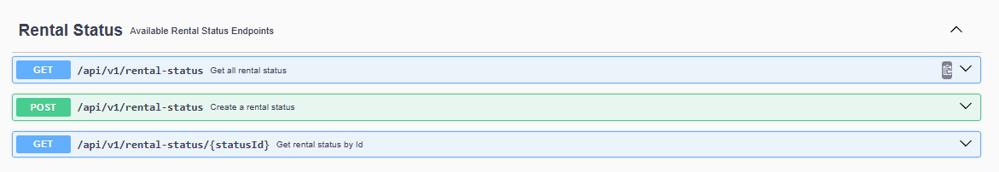

#### Notifications:

  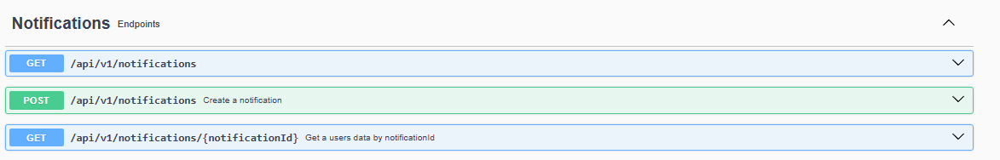

#### User Roles:

  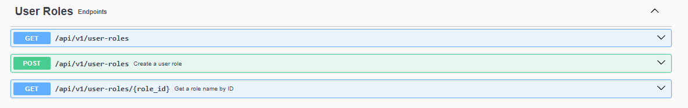

#### Lender Profiles:

  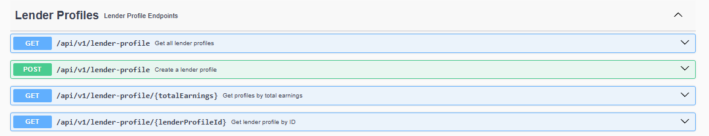

#### Bikes:

  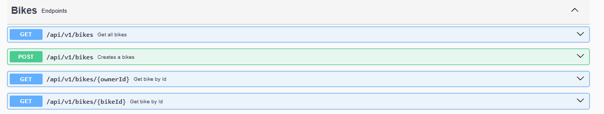

#### Reviews:

  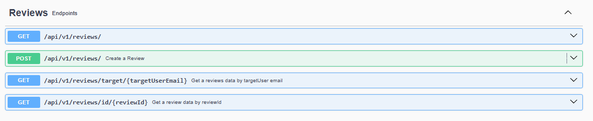

#### Bike Status: 

  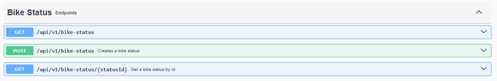

#### Bike Types:

  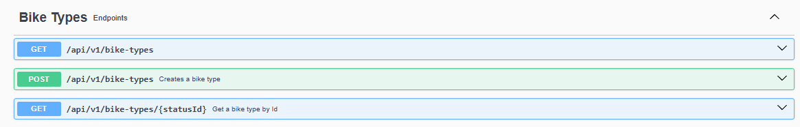

#### Users

  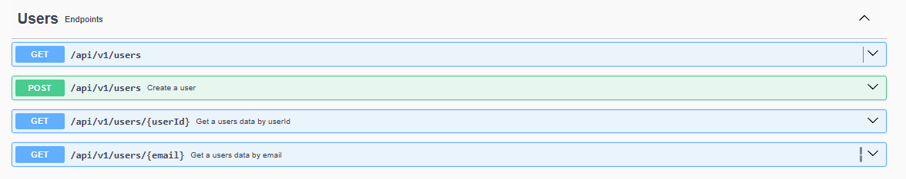

#### Rentals 

  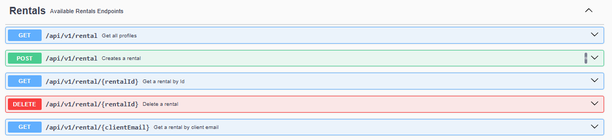

#### Notification Types 

  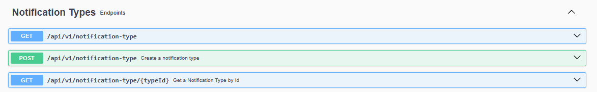

#### 5.2.3.6.Services Documentation Evidence for Sprint Review.
Durante el Sprint 3 se implementaron los siguientes endpoints en el backend de la aplicación BikeShare, siguiendo una arquitectura RESTful con Spring Boot. Todos los recursos cuentan con operaciones básicas de CRUD, y están documentados con Swagger/OpenAPI para su uso y prueba.
<table border="1" class="dataframe">
  <thead>
    <tr style="text-align: center;">
      <th>Grupo</th>
      <th>Endpoint base</th>
      <th>Acciones</th>
      <th>Metodos HTTP</th>
      <th>Descripción</th>
    </tr>
  </thead>
  <tbody>
    <tr>
      <td>Rental Status</td>
      <td>/api/v1/rental-status</td>
      <td>Get all rental status</td>
      <td>GET</td>
      <td>Obtiene todos los estados de alquiler</td>
    </tr>
    <tr>
      <td></td>
      <td>/api/v1/rental-status</td>
      <td>Create a rental status</td>
      <td>POST</td>
      <td>Crea un nuevo estado de alquiler</td>
    </tr>
    <tr>
      <td></td>
      <td>/api/v1/rental-status/{statusId}</td>
      <td>Get rental status by ID</td>
      <td>GET</td>
      <td>Obtiene un estado de alquiler por su ID</td>
    </tr>
    <tr>
      <td>Notifications</td>
      <td>/api/v1/notifications</td>
      <td>Get all notifications</td>
      <td>GET</td>
      <td>Obtiene todas las notificaciones</td>
    </tr>
    <tr>
      <td></td>
      <td>/api/v1/notifications</td>
      <td>Create a notification</td>
      <td>POST</td>
      <td>Crea una nueva notificación</td>
    </tr>
    <tr>
      <td></td>
      <td>/api/v1/notifications/{notificationId}</td>
      <td>Get user data by notification ID</td>
      <td>GET</td>
      <td>Obtiene los datos del usuario según la notificación</td>
    </tr>
    <tr>
      <td>User Roles</td>
      <td>/api/v1/user-roles</td>
      <td>Get all user roles</td>
      <td>GET</td>
      <td>Obtiene todos los roles de usuario</td>
    </tr>
    <tr>
      <td></td>
      <td>/api/v1/user-roles</td>
      <td>Create a user role</td>
      <td>POST</td>
      <td>Crea un nuevo rol de usuario</td>
    </tr>
    <tr>
      <td></td>
      <td>/api/v1/user-roles/{role_id}</td>
      <td>Get a role name by ID</td>
      <td>GET</td>
      <td>Obtiene un nombre de rol por ID</td>
    </tr>
    <tr>
      <td>Lender Profiles</td>
      <td>/api/v1/lender-profile</td>
      <td>Get all lender profiles</td>
      <td>GET</td>
      <td>Obtiene todos los perfiles de prestadores</td>
    </tr>
    <tr>
      <td></td>
      <td>/api/v1/lender-profile</td>
      <td>Create a lender profile</td>
      <td>POST</td>
      <td>Crea un perfil de prestador</td>
    </tr>
    <tr>
      <td></td>
      <td>/api/v1/lender-profile/{totalEarnings}</td>
      <td>Get profiles by total earnings</td>
      <td>GET</td>
      <td>Obtiene perfiles según ganancias totales</td>
    </tr>
    <tr>
      <td></td>
      <td>/api/v1/lender-profile/{lenderProfileId}</td>
      <td>Get lender profile by ID</td>
      <td>GET</td>
      <td>Obtiene un perfil de prestador por ID</td>
    </tr>
    <tr>
      <td>Bikes</td>
      <td>/api/v1/bikes</td>
      <td>Get all bikes</td>
      <td>GET</td>
      <td>Obtiene todas las bicicletas</td>
    </tr>
    <tr>
      <td></td>
      <td>/api/v1/bikes</td>
      <td>Create a bike</td>
      <td>POST</td>
      <td>Crea una nueva bicicleta</td>
    </tr>
    <tr>
      <td></td>
      <td>/api/v1/bikes/{ownerId}</td>
      <td>Get bikes by owner ID</td>
      <td>GET</td>
      <td>Obtiene bicicletas por ID de propietario</td>
    </tr>
    <tr>
      <td></td>
      <td>/api/v1/bikes/{bikeId}</td>
      <td>Get bike by ID</td>
      <td>GET</td>
      <td>Obtiene una bicicleta por su ID</td>
    </tr>
    <tr>
      <td>Reviews</td>
      <td>/api/v1/reviews</td>
      <td>Get all reviews</td>
      <td>GET</td>
      <td>Obtiene todas las reseñas</td>
    </tr>
    <tr>
      <td></td>
      <td>/api/v1/reviews</td>
      <td>Create a review</td>
      <td>POST</td>
      <td>Crea una reseña</td>
    </tr>
    <tr>
      <td></td>
      <td>/api/v1/reviews/target/{targetUserEmail}</td>
      <td>Get reviews by target email</td>
      <td>GET</td>
      <td>Obtiene reseñas por email de usuario</td>
    </tr>
    <tr>
      <td></td>
      <td>/api/v1/reviews/id/{reviewId}</td>
      <td>Get review by ID</td>
      <td>GET</td>
      <td>Obtiene una reseña por su ID</td>
    </tr>
    <tr>
      <td>Bike Status</td>
      <td>/api/v1/bike-status</td>
      <td>Get all bike statuses</td>
      <td>GET</td>
      <td>Obtiene todos los estados de bicicletas</td>
    </tr>
    <tr>
      <td></td>
      <td>/api/v1/bike-status</td>
      <td>Create a bike status</td>
      <td>POST</td>
      <td>Crea un estado de bicicleta</td>
    </tr>
    <tr>
      <td></td>
      <td>/api/v1/bike-status/{statusId}</td>
      <td>Get bike status by ID</td>
      <td>GET</td>
      <td>Obtiene estado de bicicleta por ID</td>
    </tr>
    <tr>
      <td>Bike Types</td>
      <td>/api/v1/bike-types</td>
      <td>Get all bike types</td>
      <td>GET</td>
      <td>Obtiene todos los tipos de bicicleta</td>
    </tr>
    <tr>
      <td></td>
      <td>/api/v1/bike-types</td>
      <td>Create a bike type</td>
      <td>POST</td>
      <td>Crea un tipo de bicicleta</td>
    </tr>
    <tr>
      <td></td>
      <td>/api/v1/bike-types/{statusId}</td>
      <td>Get a bike type by ID</td>
      <td>GET</td>
      <td>Obtiene un tipo de bicicleta por ID</td>
    </tr>
    <tr>
      <td>Users</td>
      <td>/api/v1/users</td>
      <td>Get all users</td>
      <td>GET</td>
      <td>Obtiene todos los usuarios</td>
    </tr>
    <tr>
      <td></td>
      <td>/api/v1/users</td>
      <td>Create a user</td>
      <td>POST</td>
      <td>Crea un nuevo usuario</td>
    </tr>
    <tr>
      <td></td>
      <td>/api/v1/users/{userId}</td>
      <td>Get a user by ID</td>
      <td>GET</td>
      <td>Obtiene un usuario por ID</td>
    </tr>
    <tr>
      <td></td>
      <td>/api/v1/users/{email}</td>
      <td>Get user by email</td>
      <td>GET</td>
      <td>Obtiene un usuario por email</td>
    </tr>
    <tr>
      <td>Rentals</td>
      <td>/api/v1/rental</td>
      <td>Get all rentals</td>
      <td>GET</td>
      <td>Obtiene todos los alquileres</td>
    </tr>
    <tr>
      <td></td>
      <td>/api/v1/rental</td>
      <td>Create a rental</td>
      <td>POST</td>
      <td>Crea un nuevo alquiler</td>
    </tr>
    <tr>
      <td></td>
      <td>/api/v1/rental/{rentalId}</td>
      <td>Get rental by ID</td>
      <td>GET</td>
      <td>Obtiene un alquiler por ID</td>
    </tr>
    <tr>
      <td></td>
      <td>/api/v1/rental/{rentalId}</td>
      <td>Delete a rental</td>
      <td>DELETE</td>
      <td>Elimina un alquiler</td>
    </tr>
    <tr>
      <td></td>
      <td>/api/v1/rental/{clientEmail}</td>
      <td>Get rental by client email</td>
      <td>GET</td>
      <td>Obtiene un alquiler por email del cliente</td>
    </tr>
    <tr>
      <td>Notification Types</td>
      <td>/api/v1/notification-type</td>
      <td>Get all notification types</td>
      <td>GET</td>
      <td>Obtiene todos los tipos de notificación</td>
    </tr>
    <tr>
      <td></td>
      <td>/api/v1/notification-type</td>
      <td>Create a notification type</td>
      <td>POST</td>
      <td>Crea un tipo de notificación</td>
    </tr>
    <tr>
      <td></td>
      <td>/api/v1/notification-type/{typeId}</td>
      <td>Get a notification type by ID</td>
      <td>GET</td>
      <td>Obtiene un tipo de notificación por ID</td>
    </tr>
  </tbody>
</table>

A continuación se presenta un resumen de los endpoints disponibles y sus principales operaciones:
#### 5.2.3.7.Software Deployment Evidence for Sprint Review.
A continuación, se muestran las capturas del despliegue de la API junto a las base de datos:

- Aiven:    

 

- Render:   
 

 

#### 5.2.3.8.Team Collaboration Insights during Sprint
Durante este sprint, la colaboración del equipo se mantuvo constante y bien organizada, facilitando el cumplimiento exitoso de los objetivos establecidos.En la reunión, se asignaron responsabilidades específicas a cada integrante, permitiendo una distribución eficiente del trabajo y un entendimiento claro de las tareas a ejecutar. A lo largo de este sprint se lograron avances significativos en el desarrollo del Front-End de BikeShare, empleando Angular CLI y SpringBoot. Se llevaron a cabo implementaciones clave, entre las que destacan la realizacion de los endpoints de las APIRest, la conexion con la base de datos y el frontend.

 

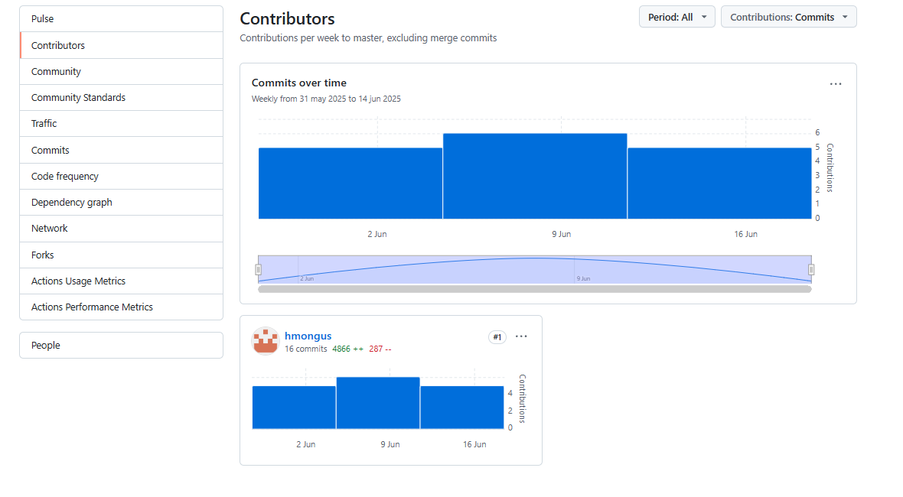

 

## 5.3. Validation Interviews.
### 5.3.1. Diseño de Entrevistas.

Para cada uno de los segmentos identificados, se han formulado las siguientes preguntas:

    ### Segmento #1: Personas interesadas en alquilar bicicletas (Arrendatarios)

     - ¿Cuál es su nombre, edad y en qué distrito vive?
     - ¿Cuándo fue la última vez que tuvo dificultades para movilizarse en la ciudad?
     - ¿Qué hizo en ese momento? ¿Cómo se sintió?
     - ¿Alguna vez pensó: “Si tuviera una bicicleta en este momento, sería más fácil”?
     - ¿Qué opinas de una app donde puedas alquilar bicicletas de personas que las comparten cerca de ti?
     - Si esta app existiera mañana, ¿la descargarías y la usarías? ¿Por qué sí o por qué no?
     - ¿Qué te haría sentir confianza para alquilar la bici de alguien que no conoces?
     - ¿Qué debería tener una app así para que digas: “vale la pena usarla”?
     - ¿Preferirías alquilar bicicletas por minutos, por horas o por recorrido?
     - ¿Cuánto estarías dispuesto a pagar por un alquiler promedio (ej. 30 minutos)?
     - ¿Has usado alguna vez un scooter o bici compartida como CityBike, Lime o similar?
     - ¿Qué fue lo mejor y lo peor de esa experiencia?
     - Si te invitáramos a probar una versión inicial de la app, ¿estarías dispuesto/a a usarla durante una semana?
     - ¿Nos darías feedback después de probarla?
   

    ### Segmento #2: Personas dispuestas a rentar sus bicicletas (Arrendadores)

     - ¿Tienes una bicicleta que no usas frecuentemente? ¿Con qué frecuencia la usas realmente?
     - ¿Te gustaría generar ingresos extra con ella?
     - ¿Qué te parece la idea de compartir tu bici con otros mediante una app, a cambio de un pago?
     - ¿Qué cosas te generarían más dudas o temores sobre hacerlo?
     - ¿Qué tendría que ofrecerte una app para que te animes a poner tu bici en alquiler?
     - ¿Te interesaría poder decidir a quién se la alquilas? ¿Por cuánto tiempo?
     - ¿Qué nivel de ingreso mensual te parecería interesante para participar?
     - ¿Qué herramientas necesitas para sentir que tienes control sobre el uso de tu bicicleta?
     - ¿Qué medidas de seguridad o garantías debería darte la app?
     - ¿Te gustaría tener alertas, geolocalización, seguro, o soporte técnico?
     - Si te diéramos acceso a una versión beta para que publiques tu bici por una semana, ¿te animarías a probarla?
     - ¿Qué necesitarías para recomendar esta app a tus amigos ciclistas?
     
### 5.3.2. Registro de Entrevistas.

 Para cada segmento se registraron 3 entrevistas. A continuación se muestra la recolección de datos que conseguimos tras realizar cada entrevista.  
Se puede ver el video consolidado con todas las entrevistas realizadas en el siguiente enlace: [Ver video en Microsoft Stream](https://upcedupe-my.sharepoint.com/:v:/g/personal/u202219481_upc_edu_pe/EXe7VEo3qRNLga7Dad4XsmEBq7EjGcMkY2Qbf_AZrcvSHQ?nav=eyJyZWZlcnJhbEluZm8iOnsicmVmZXJyYWxBcHAiOiJTdHJlYW1XZWJBcHAiLCJyZWZlcnJhbFZpZXciOiJTaGFyZURpYWxvZy1MaW5rIiwicmVmZXJyYWxBcHBQbGF0Zm9ybSI6IldlYiIsInJlZmVycmFsTW9kZSI6InZpZXcifX0%3D&e=K2EsaK).

**Segmento #1: Personas interesadas en alquilar bicicletas (Arrendatarios)**

| Nº Entrevista | Datos del entrevistado                                                                                                                                                                | Resumen de la entrevista                                                                                                                                                                                                                                                                                                                                                                                                                                                                                       | Evidencia de entrevista                          |
|---------------|----------------------------------------------------------------------------------------------------------------------------------------------------------------------------------------|------------------------------------------------------------------------------------------------------------------------------------------------------------------------------------------------------------------------------------------------------------------------------------------------------------------------------------------------------------------------------------------------------------------------------------------------------------------------------------------------------------------|--------------------------------------------------|
| 1             | - **Nombre:** Camila Ruiz   - **Edad:** 224 años    - **Distrito:** San Borja   - **Momento que inicia:** 00:16    - **Momento que termina:** 05:50    - **Duración:** 5 min 34 seg | Camila se moviliza por Lima con frecuencia y sufre los efectos del tráfico. Le atrae la idea de alquilar bicis cercanas mediante app, pero su confianza depende de ver calificaciones, fotos y tener garantías de seguridad. Está dispuesta a pagar hasta S/3 por 30 min y probaría encantada una versión beta. | 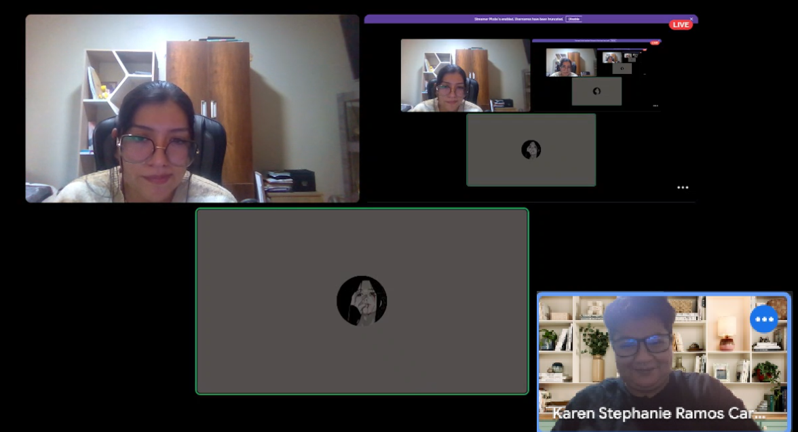              |
| 2             | - **Nombre:** Luis Delgado    - **Edad:** 31 años    - **Distrito:** Magdalena   - **Momento que inicia:** 05:53    - **Momento que termina:** 11:14    - **Duración:** 5 min 61 seg | Luis ha probado bicicletas públicas, pero tuvo malas experiencias. Está abierto al alquiler P2P si la bici está cerca y es confiable. Valora claridad en precios y control por tiempo. Su mayor frustración es el tráfico intenso. Probaría la app si resuelve estas molestias. | 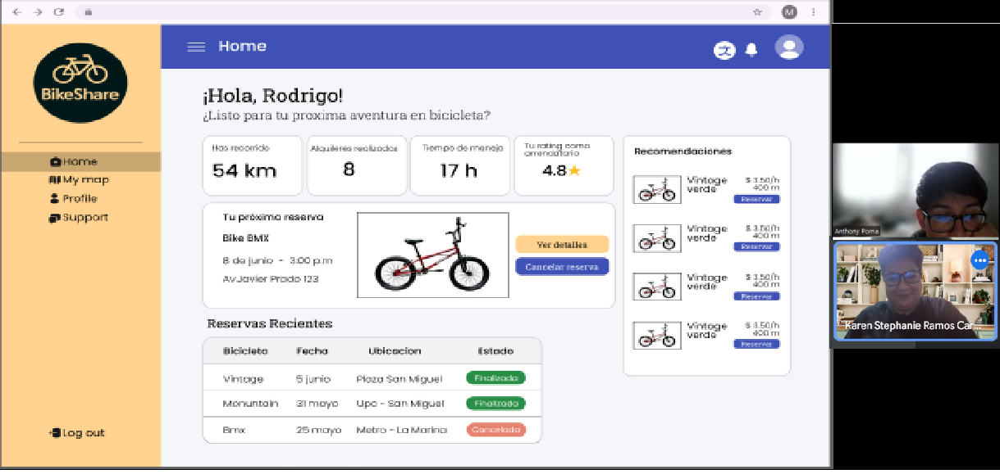              |
| 3             | - **Nombre:** Elena Vega   - **Edad:** 28 años    - **Distrito:** Pueblo libre   - **Momento que inicia:** 13:20    - **Momento que termina:** 18:25    - **Duración:** 5 min 5 seg | Juan Elena se siente cómoda usando apps desde el celular y valora rapidez y claridad. Le gusta la idea de alquilar bicis entre personas, pero exige soporte y confianza en la calidad del servicio. Está interesada en la app si incluye funciones como seguros o asistencia ante problemas.| 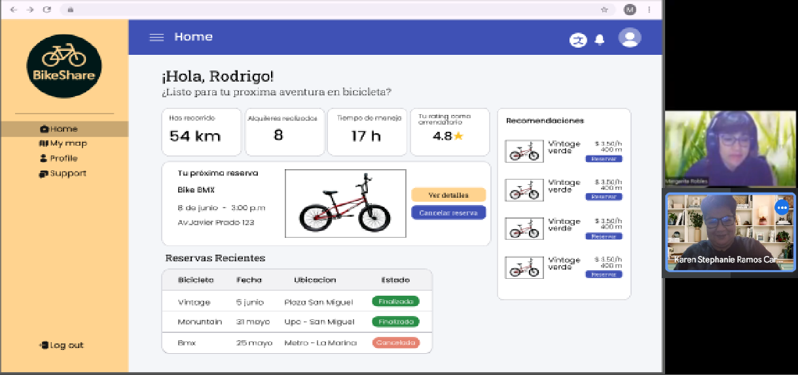              |

   #### Resumen de entrevistas  segmento #1
Los usuarios interesados en alquilar bicicletas manifestaron un fuerte interés en contar con una solución de movilidad alternativa que les permita evitar el tráfico y los tiempos muertos del transporte público. Valoraron positivamente la posibilidad de alquilar bicicletas cercanas mediante una app, siempre que esta sea fácil de usar, permita ver reseñas del arrendador y ofrezca garantías mínimas de seguridad. La confianza, el estado del vehículo y la claridad en la tarifa fueron aspectos clave. Todos indicaron que pagar desde el celular sería cómodo, y varios expresaron disposición a participar en una versión beta de la aplicación.

  **Segmento #2: Personas dispuestas a rentar sus bicicletas (Arrendadores)**

   

| Nº Entrevista | Datos del entrevistado                                                                                                                                                                | Resumen de la entrevista                                                                                                                                                                                                                                                                                                                                                                                                                                                                                       | Evidencia de entrevista                          |
|---------------|----------------------------------------------------------------------------------------------------------------------------------------------------------------------------------------|------------------------------------------------------------------------------------------------------------------------------------------------------------------------------------------------------------------------------------------------------------------------------------------------------------------------------------------------------------------------------------------------------------------------------------------------------------------------------------------------------------------|--------------------------------------------------|
| 1             | - **Nombre:** Diego Salinas   - **Edad:** 35 años   - **Distrito:** Pueblo Libre   - **Momento que inicia:** 18:30   - **Momento que termina:** 24:42   - **Duración:** 6 min 12 seg | Diego usa poco su bici entre semana y estaría dispuesto a alquilarla si tiene control sobre el proceso. Necesita garantías, horarios definidos y alertas constantes. Ve con buenos ojos la oportunidad de ingresos pasivos y conoce a otros posibles usuarios interesados.| 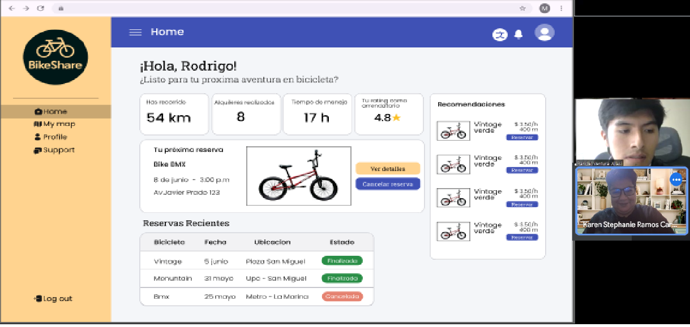              |
| 2             | - **Nombre:** Patricia Córdova   - **Edad:** 36 años   - **Distrito:** Miraflores   - **Momento que inicia:** 24:47   - **Momento que termina:** 30:08   - **Duración:** 5 min 61 seg | Patricia confía en plataformas colaborativas, pero es muy cuidadosa con su bicicleta. Requiere reputación del arrendatario, opciones de pago seguras y soporte en caso de daño. Valora ayudar a la comunidad y obtener ingresos extra. Estaría dispuesta a testear la app. | 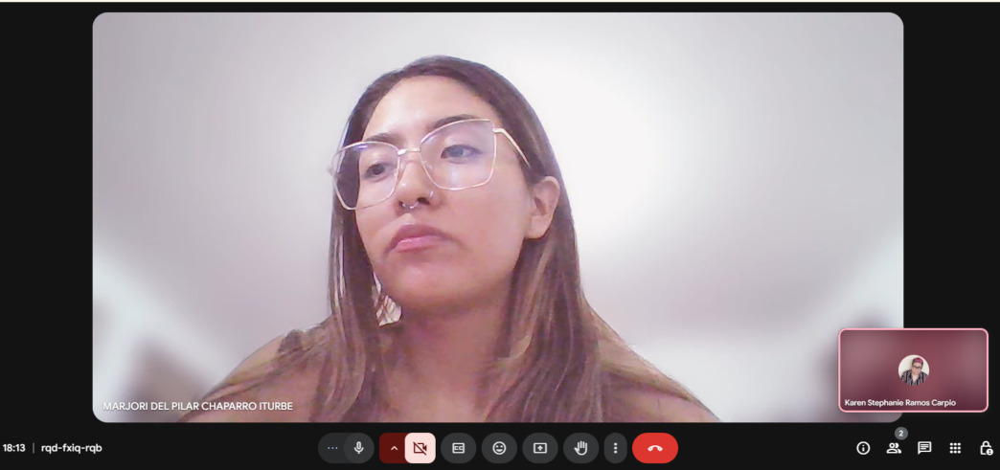              |
| 3             | - **Nombre:** Javier Mendoza   - **Edad:** 27 años   - **Distrito:** San Juan de Lurigancho   - **Momento que inicia:** 30:25   - **Momento que termina:** 34:11   - **Duración:** 3 min 86 seg | Javier no había considerado alquilar su bici, pero lo encuentra atractivo ahora. Quiere control sobre precios, necesita garantías de seguridad (GPS, seguro) y soporte. Considera que recomendaría la app solo si funciona sin generar estrés ni riesgos. |               |

#### Resumen de entrevistas segemento #2
Los potenciales arrendadores reconocen que tienen bicicletas poco utilizadas y ven con buenos ojos la posibilidad de generar ingresos extra a través de una app colaborativa. Sin embargo, su participación está condicionada a tener control total sobre el alquiler (precio, tiempo, disponibilidad), así como a contar con medidas de seguridad claras, como geolocalización, sistema de reputación y soporte en caso de incidentes. La mayoría mencionó que solo participarían si la plataforma garantiza respaldo ante daños o mal uso de sus bicicletas, y están abiertos a probar el servicio si se sienten protegidos y escuchados.

### 5.3.3. Evaluaciones según heurísticas.

### SITE o APP A EVALUAR:
 BikeShare
 Meta: El propósito general de la evaluación es encontrar problemas existentes en la aplicación web BikeShare.
 Cómo: Los hallazgos del sitio web se llevarán a cabo utilizando la Lista Heurística de Nielsen, inicialmente investigada y creada
 por Jakob Nielsen.

### TAREAS A EVALUAR:
Incluidas en esta versión:
1. Registro de un nuevo usuario
2. Inicio de sesión
3. Recuperación de contraseña
4. Visualización de bicicletas disponibles (renter)
5. Mapa con bicicletas cercanas (renter)
6. Reservar bicicleta (renter)
7. Ver perfil y soporte (ambos roles)
8. Ver lista de bicicletas propias (owner)
9. Ver reservas recibidas (owner)
    
No incluidas en esta versión:

1. Reportes de fallas de bicicletas
2. Integración con sistemas de pago reales
3. Funcionalidad de calificaciones o reseñas
4. Interacción por chat entre renter y owner

 ### ESCALA DE SEVERIDAD:
 Los errores serán puntuados tomando en cuenta la siguiente escala de severidad

| Nivel        | Descripción
|--------------|----------------------------------------------------------------------------------------------------------------------------------------------------------------------------------------|
| 1            |Problema superficial: puede ser fácilmente superado por el usuario o ocurre con muy poca frecuencia. No necesita ser arreglado a no ser que exista disponibilidad de tiempo. |
| 2            | Problema menor: puede ocurrir un poco más frecuentemente o es un poco más difícil de superar para el usuario. Se le debería asignar una prioridad baja resolverlo de cara al siguiente reléase. |
| 3            | Problema mayor: ocurre frecuentemente o los usuarios no son capaces de resolverlos. Es importante que sean corregidos y se les debe asignar una prioridad alta.  |
| 4            | Problema muy grave: un error de gran impacto que impide al usuario continuar con el uso de la herramienta. Es imperativo que sea corregido antes del lanzamiento. |

### TABLA RESUMEN:

| #     | Problema                                                                         | Escala de severidad    |  Heurística/Principio violada(o)                                                       |
|-------|----------------------------------------------------------------------------------|------------------------|----------------------------------------------------------------------------------------|
| 1     | No hay botón para regresar al home desde la vista de reservas | 2 | Usabilidad – Libertad y control del usuario |
| 2     | Falta consistencia en íconos entre vistas de renter y owner |  2  | Usabilidad – Consistencia y estándares |
| 3     | No se valida el formato del correo en registro |  3  |Usabilidad – Prevención de errores  |
| 4     | En soporte no hay feedback claro luego de enviar mensaje |  3| Inclusive Design – Feedback perceptible |
| 5     | El mapa no tiene leyenda ni explicación contextual |   2 | Information Architecture – ¿Es entendible? |
| 6     | En el perfil, los campos no editables parecen editables |    2  |  Usabilidad – Visibilidad del estado del sistema  |
| 7     | El botón de reservar no solicita confirmación  |   3 | Usabilidad – Prevención de errores |
| 8     | El campo de mensaje en soporte no tiene texto guía |   2  |  Inclusive Design – Comprensión clara  |
| 9     | No hay indicador de carga al hacer login o registro |   2  |  Usabilidad – Visibilidad del estado del sistema  |
| 10    | Exceso de espacio en blanco en la vista de perfil |   1 |  Usabilidad – Estética y diseño minimalista |
| 11    | No se puede cancelar una reserva como owner  |    3  | Usabilidad – Control y libertad del usuario |
| 12    | Menú lateral no muestra resaltado del módulo activo |   2  | Information Architecture – ¿Es encontrable? |

### PROBLEMA #1
Severidad: 2

Heurística violada: Usabilidad – Libertad y control del usuario

Descripción: En la vista de reservas (Reservations-owner), no existe un botón visible para regresar al home o panel principal del propietario.

  

Recomendación: Incluir un botón “Volver al inicio” visible en el menú o en la parte superior de la interfaz. 

### PROBLEMA #2
Severidad: 2

Heurística violada: Usabilidad – Consistencia y estándares

Descripción: El estilo de íconos y botones varía entre renter y owner, afectando la predictibilidad de la navegación.

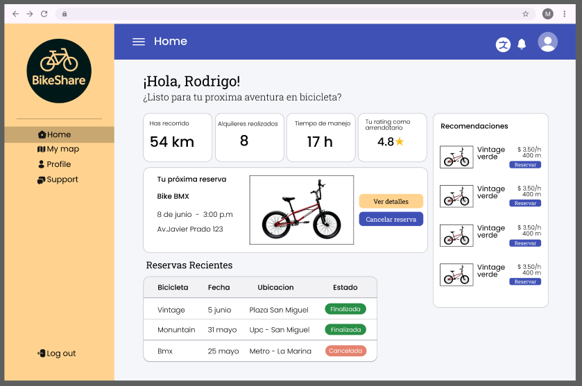  

Recomendación: Unificar diseño visual y estructura de navegación en ambos roles.

### PROBLEMA #3
Severidad: 3

Heurística violada: Usabilidad – Prevención de errores

Descripción: En el formulario de registro no se valida adecuadamente el campo email, permitiendo textos no válidos.

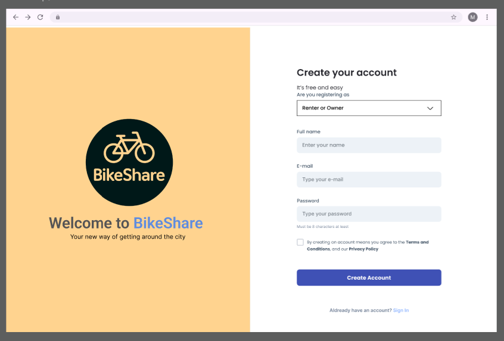  

Recomendación: Agregar validación HTML y mensajes de error amigables para campos clave.

### PROBLEMA #4
Severidad: 3

Heurística violada: Inclusive Design – Feedback perceptible

Descripción: El usuario no recibe retroalimentación visual después de enviar una consulta desde la sección de soporte.

  

Recomendación: Mostrar un mensaje de confirmación, animación o alerta para asegurar al usuario que su solicitud fue procesada.

### PROBLEMA #5
Severidad: 2

Heurística violada: Information Architecture – ¿Es entendible?

Descripción: El mapa de bicicletas cercanas no incluye una leyenda que explique los pines o colores.

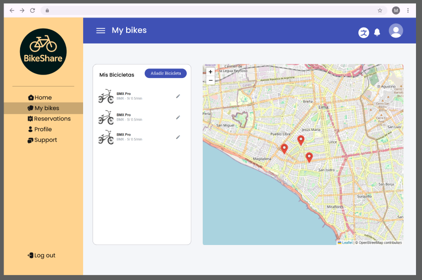  

Recomendación: Añadir leyenda o íconos explicativos que brinden contexto inmediato.

### PROBLEMA #6
Severidad: 2

Heurística violada: Usabilidad – Visibilidad del estado del sistema

Descripción: Los campos no editables en la vista de perfil parecen campos interactivos, lo que genera confusión.

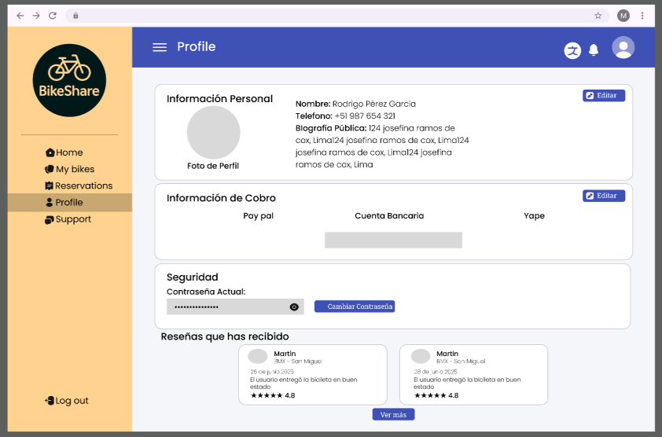  

Recomendación: Utilizar colores más neutros o estados deshabilitados claros para distinguirlos visualmente.

### PROBLEMA #7
Severidad: 3

Heurística violada: Usabilidad – Prevención de errores

Descripción: En la vista de reserva (Home-renter), el botón de “Reservar” no solicita confirmación antes de ejecutar la acción, lo que puede llevar a clics accidentales.

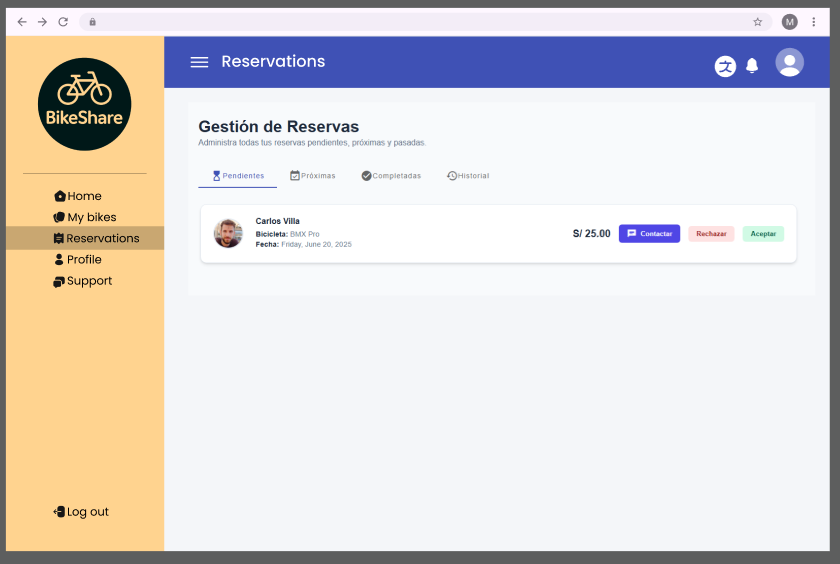  

Recomendación: Agregar un diálogo de confirmación (“¿Estás seguro de que deseas reservar esta bicicleta?”).

### PROBLEMA #8
Severidad: 2

Heurística violada: Inclusive Design – Comprensión clara

Descripción: En la vista de soporte (Support-renter), el campo de mensaje no tiene un texto guía o placeholder, lo que puede confundir sobre qué escribir.

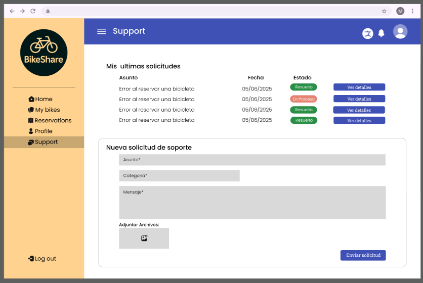  

Recomendación: Incluir un texto guía como “Escribe aquí tu duda o comentario”.

### PROBLEMA #9
Severidad: 2

Heurística violada: Usabilidad – Visibilidad del estado del sistema

Descripción: Al hacer login o registrarse, no se muestra un indicador de carga. El usuario no sabe si la app está procesando la solicitud.

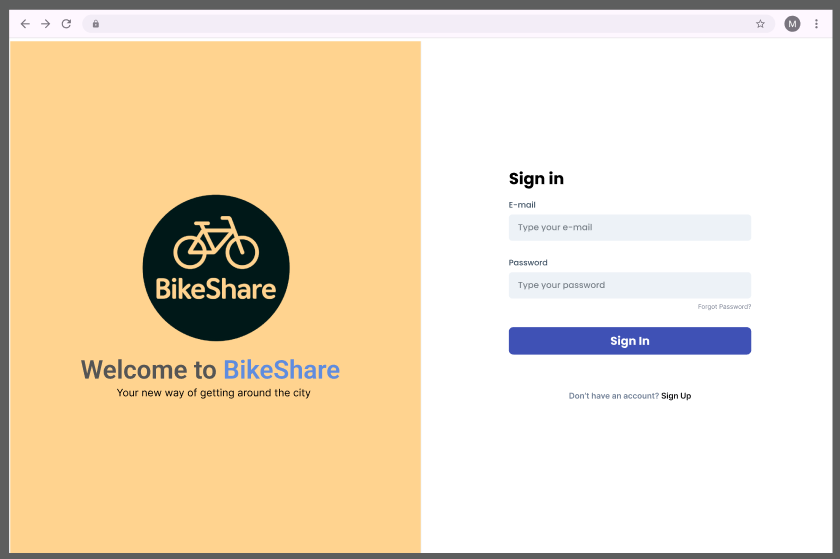  

Recomendación: Incluir un spinner o mensaje tipo “Iniciando sesión…” mientras se espera respuesta del servidor.

### PROBLEMA #10
Severidad: 1

Heurística violada: Usabilidad – Estética y diseño minimalista

Descripción: En la vista del perfil (Profile-owner), hay mucho espacio en blanco sin propósito, lo que puede generar una percepción de diseño incompleto.

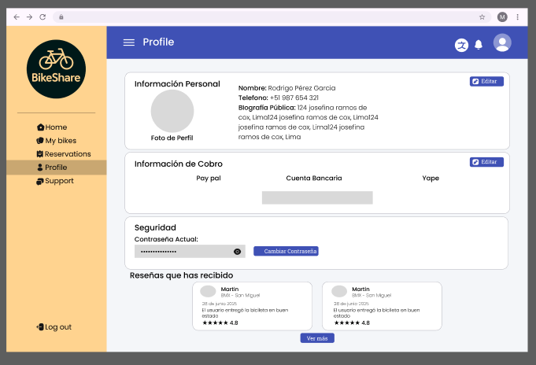  

Recomendación: Reorganizar elementos para usar mejor el espacio o incluir sección de “Datos adicionales”.

### PROBLEMA #11
Severidad: 3

Heurística violada: Usabilidad – Control y libertad del usuario

Descripción: El usuario no puede cancelar una reserva desde la vista Reservations-owner. Esta limitación obliga a depender del administrador.

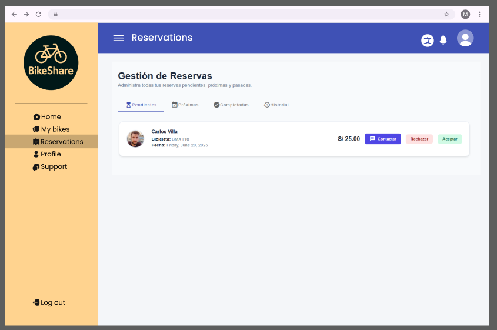  

Recomendación: Añadir botón de “Cancelar reserva” con opción de justificación.

### PROBLEMA #12
Severidad: 2

Heurística violada: Information Architecture – ¿Es encontrable?

Descripción: La navegación lateral no tiene resaltado activo del módulo en el que se encuentra el usuario.

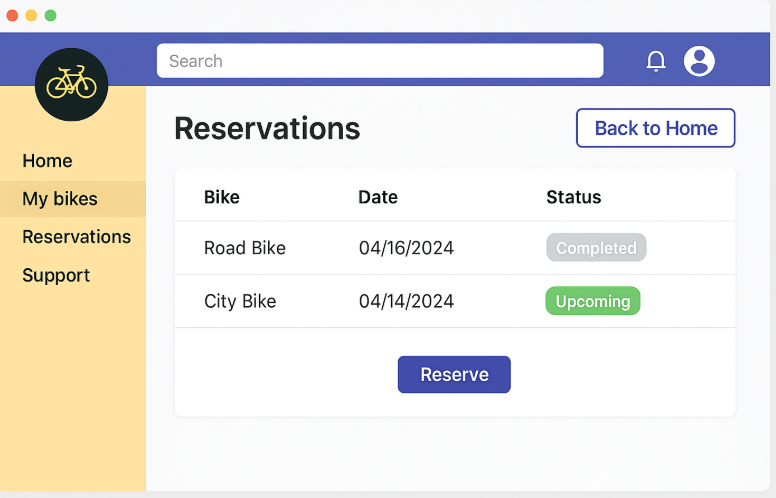  

Recomendación: Añadir estilos o resaltado (como subrayado o color) al ítem del menú activo.

## 5.4. Video About-the-Product

Para la presentación de las características que hacen destacar a nuestro producto, hemos realizado un video en el que se presenta la aplicación y sus funciones principales. Es una explicación amigable y sutil ya que buscamos generar confianza con el usuario desde un principio.

Link del video: https://youtu.be/AbJAPa_9phU

